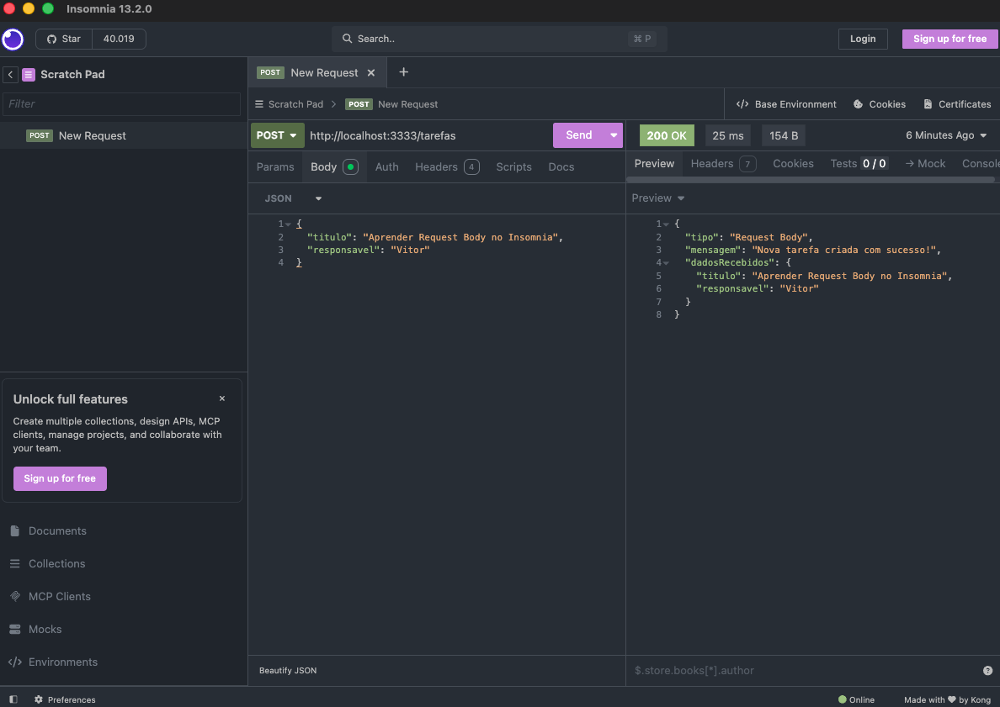

# 🚀 Estudo de API em Node.js + TypeScript

Projeto prático para aprender a base de um servidor backend do zero usando Node.js, Express e TypeScript.

---

## 🛠️ Tecnologias Usadas
- Node.js
- Express
- TypeScript
- Yarn
- ts-node-dev

---

## 📌 O que foi feito até agora
- Configuração do servidor HTTP com Express.
- Setup do ambiente com TypeScript e autoreload (`ts-node-dev`).
- Conceitos praticados:
  - **Query Params (`req.query`):** Filtros e buscas via URL (`GET /busca`).
  - **Route Params (`req.params`):** Identificação de recursos por ID (`GET /tarefas/:id`).
  - **Request Body (`req.body`):** Envio de dados via corpo da requisição (`POST /tarefas`).

---

## 📍 Endpoints da API

| Método | Endpoint | Descrição | Exemplo |
| :--- | :--- | :--- | :--- |
| `GET` | `/tarefas` | Rota inicial da aplicação | `http://localhost:3333/tarefas` |
| `GET` | `/busca` | Teste de Query Params | `http://localhost:3333/busca?termo=node` |
| `GET` | `/tarefas/:id` | Teste de Route Params | `http://localhost:3333/tarefas/1` |
| `POST` | `/tarefas` | Teste de Request Body (JSON) | Envio via Insomnia / Postman |

---

## 📸 Demonstração de Teste

### Rota `POST /tarefas` (Request Body no Insomnia)


---

## 🚀 Como Rodar

```bash
# Instalar dependências
yarn

# Rodar o servidor
yarn dev